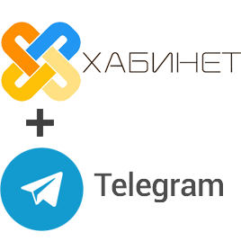

Хабинет и Telegram
------------------

Сервис Хабинет тесно взаимодействует с Telegram. Установив Telegram, вы сможете пользоваться функциями Хабинета через общение с Хабинет-ботом и получать уведомления! 
При регистрации в Хабинет в Telegram автоматически создаются чат класса, в котором общаются родители, и канал класса, куда транслируются объявления (подробнее см. `раздел 5 <http://habinet.readthedocs.io/ru/latest/05-telegram/index.html>`_).