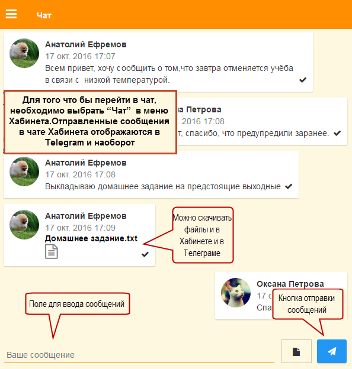

Как общаться с другими родителями класса?
-----------------------------------------
Чтобы общаться с другими родителями, нужно выбрать пункт меню "Чат" и начать вводить сообщение или просмотреть историю чата. Так же можно воспользоваться чатом в Telegram.

