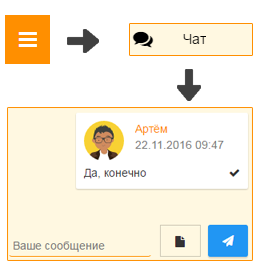

Как общаться с другими родителями класса?
-----------------------------------------

**Через Хабинет:**

1. Откройте "Главное меню" и выберите пункт "Чат".

2. Ввведите текст сообщения (при необходимости прикрепите файл к сообщению, нажав кнопку "Прикрепить файл") и нажмите кнопку "Отправить".

**Через Telegram (подробнее см. раздел** `5.1 <http://habinet.readthedocs.io/ru/latest/05-telegram/index.html#id1>`_ **).**
