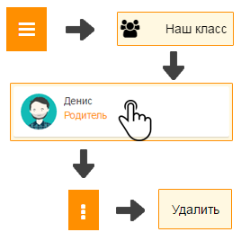

Как выйти из класса?
---------------------------------
	

	
1. Откройте главное меню и выберите пункт "Наш класс".

2. Откройте свой профиль, нажмите кнопку "Контекстное меню", затем кнопку "Удалить". 

Как исключить родителя из класса
~~~~~~~~~~~~~~~~~~~~~~~~~~~~~~~~~

**Исключить родителя может только председатель.**

1. Откройте главное меню и выберите пункт "Наш класс".

2. Выберите родителя, нажмите кнопку "Контекстное меню", затем кнопку "Удалить". 

