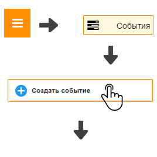
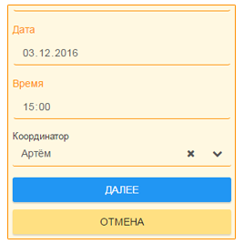

Как организовать событие в жизни класса?
----------------------------------------

1. Откройте "Главное меню" и выберите пункт "События".

2. Нажмите кнопку "Создать событие", заполните необходимые поля и нажмите кнопку "Далее", затем - кнопку "Сохранить", если событие заполнено правильно.