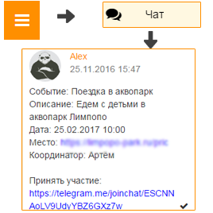

Как принять участие в событии?
------------------------------
**Первый способ:**

1. Откройте "Главное меню" и выберите пункт "События".

2. Выберите необходимое событие и нажмите кнопку "Принять участие".

**Второй способ:**

1. Откройте чат класса в Хабинет или Telegram.

2. Найдите сообщение о создании события, перейти по ссылке и нажмите кнопку "Принять участие" (в Хабинет).