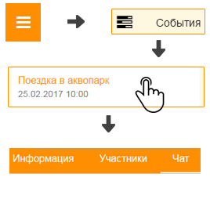

Как общаться с участниками события?
-----------------------------------
**Через Хабинет:**

1. Откройте "Главное меню" и выберите пункт "События".

2. Откройте необходимое событие и перейдите на вкладку "Чат".

**Через Telegram (подробнее см.** `раздел 5.2 <http://habinet.readthedocs.io/ru/latest/05-telegram/index.html#id2>`_ **).**
