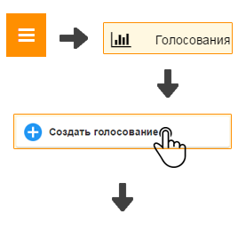
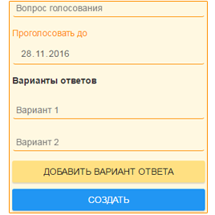

Как прийти к общему решению?
----------------------------

\

1. Откройте "Главное меню" и выберите пункт "Голосования".

2. Нажмите кнопку "Создать голосование", заполните поля (при необходимости добавьте варианты ответа нажав кнопку "Добавить вариант ответа") и нажмите кнопку "Создать".