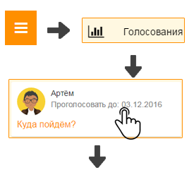
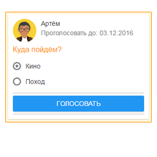
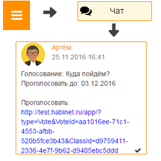

Как учесть мнение родителя?
---------------------------
**Первый способ:**

\

1. Откройте "Главное меню" и выберите пункт "Голосования".

2. Откойте необходимое голосование, выберите вариант ответа и нажмите кнопку "Голосовать".

**Второй способ:**

1. Откройте чат класса в Хабинет или Telegram.

2. Найдите сообщение о создании голосования, перейти по ссылке, выберите вариант ответа и нажмите кнопку "Голосовать".