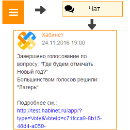

Как просмотреть результаты голосования?
---------------------------------------

**Первый способ:**

**Результаты голосования приходят в Чат класса в 19-00 по местному времени в день окончания голосования.**

1. Откройте чат класса в Хабинет или Telegram.

2. Найдите сообщение о создании голосования и посмотрите результат (Для подробной информации о результатах перейдите по ссылке). 

**Второй способ:**

1. Откройте "Главное меню" и выберите пункт "Голосования".

2. Откройте необходимое голосование и просмотрите результаты.