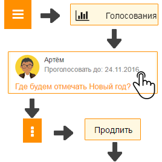

Как продлить голосование?
---------------------------------------

\

1. Откройте "Главное меню" и выберите пункт "Голосования".

2. Откройте необходимое голосование, нажмите кнопку "Контекстное меню", затем - кнопку "Продлить".

3. Измените дату окончания голосования и нажмите кнопку "Сохранить".